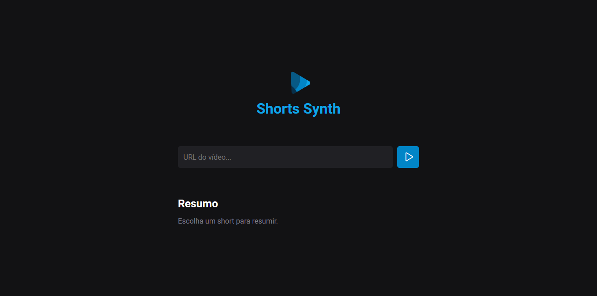

<h1 align="center">Shorts Synth</h1>

>Status: Em desenvolvimento...

  

Sintetize informações de vídeos Shorts do YouTube com IA!

## Visão Geral
O Shorts Synth é uma ferramenta que permite aos usuários inserir um link de vídeo Shorts do YouTube e receber um resumo do conteúdo do vídeo, tudo com o auxílio da inteligência artificial.

## Como Funciona
1. Cole o link do vídeo Shorts do YouTube na caixa de entrada.
2. Pressione Enter e deixe a mágica acontecer.
3. O Shorts Synth usará IA para analisar o conteúdo do vídeo e gerar um resumo.

## Tecnologias
Este projeto faz uso das seguintes tecnologias:

- HTML e CSS
- TypeScript
- Vite